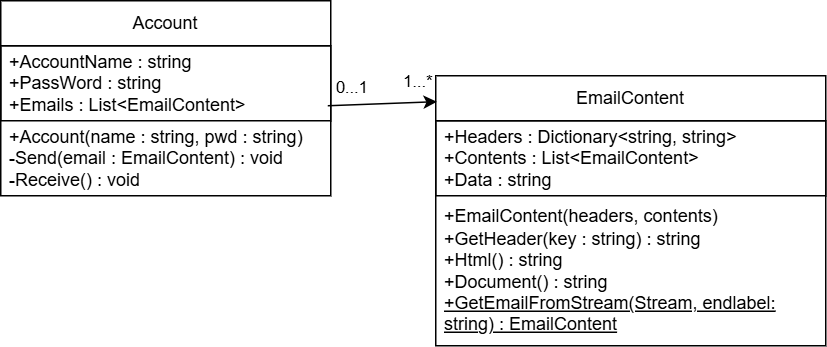
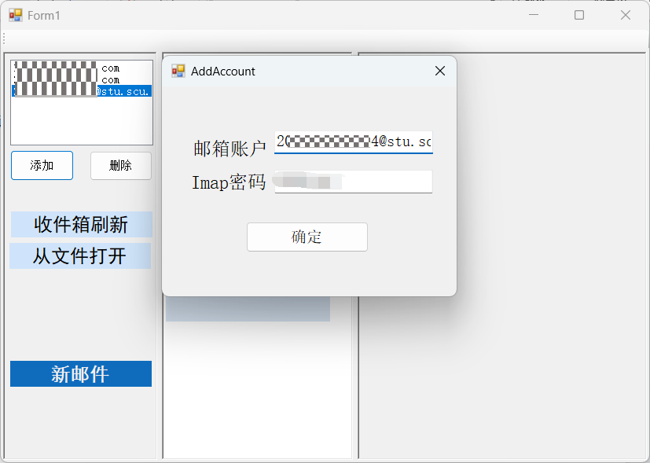
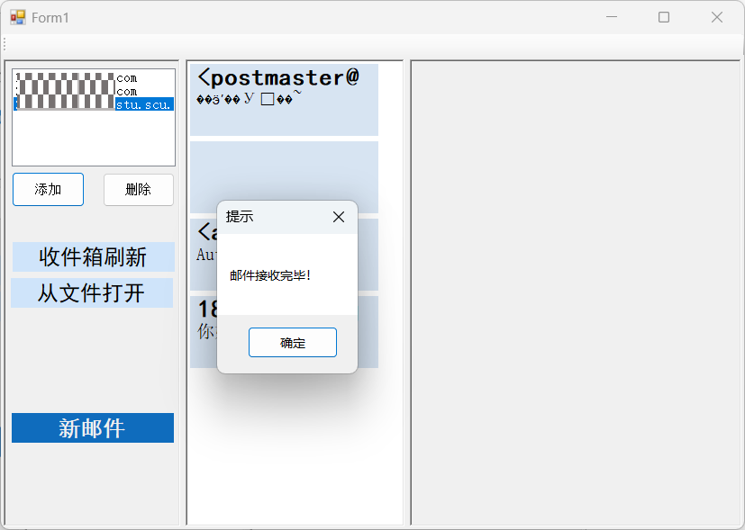
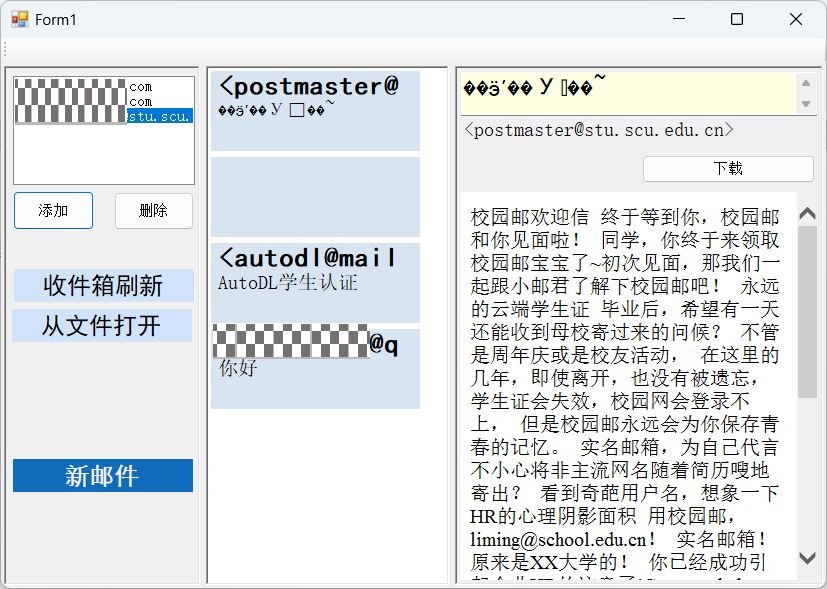
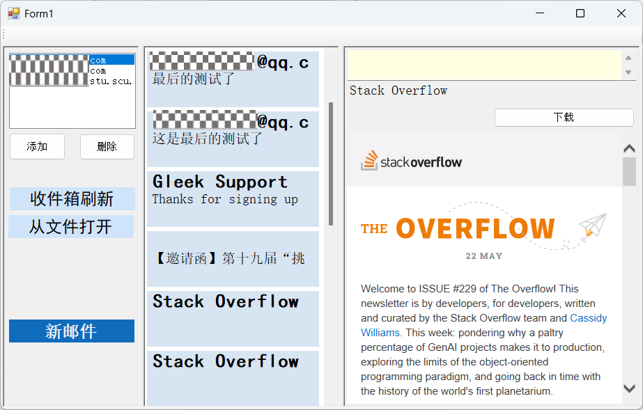
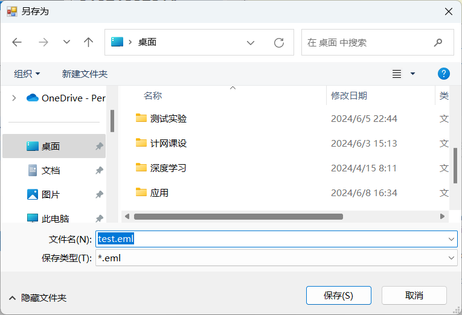
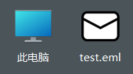
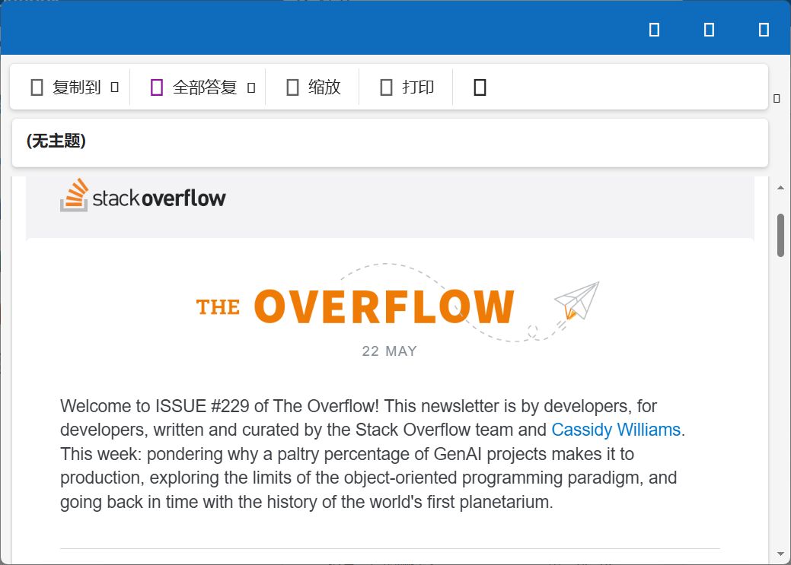
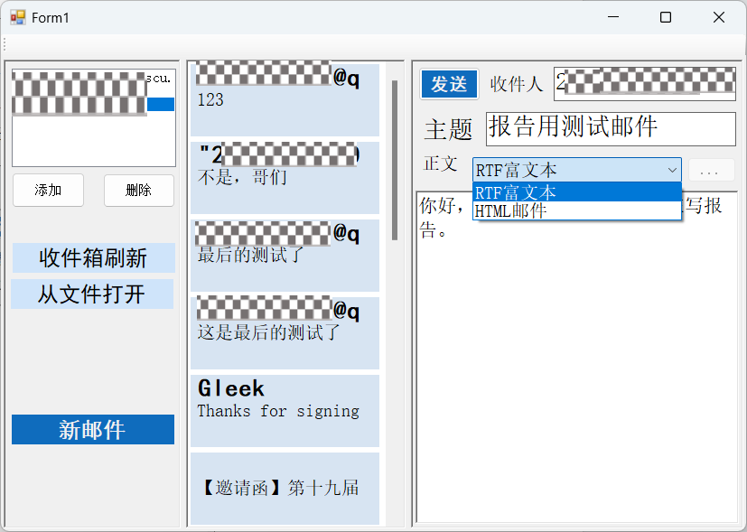
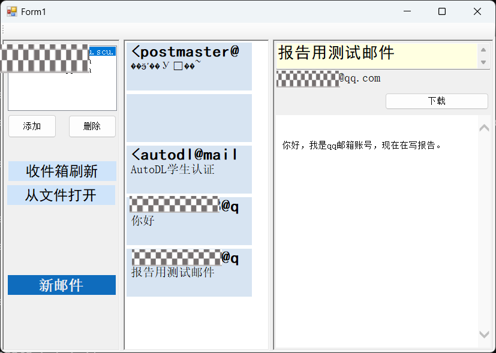

1 项目介绍

项目要求

1.用户可以通过这个代理下载自己邮箱中的电子邮件。

2.用户可以通过这个代理发送自己的电子邮件。

3.这个代理可以访问至少两个真实的电子邮件服务器

开发环境

语言：C#

桌面应用开发框架：Winform

操作系统：Windows11

IDE：VisualStudio 2022

文件说明

本次课设上交内容分为该报告和代码文件。

其中代码文件又分为打包好的可执行文件和项目源代码。

项目源代码文件说明详见ReadMe.txt。

# 2 功能实现

类图（除去了工具类和gui相关类）：

主要功能伪代码：

添加账号

输入邮箱名和密码创建一个新的Account对象，添加到Form1(主类)中的List<Account> accounts列表中。

同时使对应的gui组件显示新添加的用户。

删除账号

通过对应的gui组件获取要删除的用户的邮箱。

在accounts中找到对应的邮箱对象，删除。

然后将新的accounts列表写回文件储存。

发送邮件

用户点击“新邮件”的按钮后，获取当前选中的account。

在gui的对应位置添加SendMail组件，供用户编辑要发送的邮件，同时将获取到的account对象传给该组件。

当用户编辑好邮件内容点击组件中的“发送”按钮后，将组件中的邮件信息构造为EmailContent对象，然后调用account的Send()方法。

在account的Send()方法中，先根据account的邮箱账号通过SMTP类找到文件中储存的对应邮箱服务器的SMTP地址和端口。

然后使用tcp socket对目标服务器进行连接。

连接成功后将EmailContent的对象中的邮件内容通过Document()方法转为SMTP格式发送到目标服务器。

接收邮件

用户点击“收件箱刷新”按钮后，获取当前选中的account。

然后直接调用account中的Receive()方法

在account的Receive()方法中，先根据account的邮箱账号通过SMTP类找到文件中储存的对应邮箱服务器的POP3地址和端口。

然后使用tcp socket对目标服务器进行连接，获取对应的网络流对象stream

先根据POP3协议登陆账号，然后获取当前用户的收到的邮件的列表。

接着使用EmailContent类中的静态方法GetEmailFromStream()得到每一个邮件对应内容转换而得的EmailContent对象，添加到account的List<EmailContent> emails中。

结束Receive()方法后，将account对象传到组件MessageList中。

然后该组件遍历emails获取每一个EmailContent，创建对应的MessagePanel组件，显示到界面中。

当用户点击对应的MessagePanel组件，便会在界面的右侧区域创建ReceiveEmail组件，显示用户当前选中的邮件内容，同时将对应的EmailContent对象存入ReceiceEmail对象中。

下载邮件

当用户点击了ReceiveEmail中的“下载”按钮后，界面会弹出一个提示用户选择邮件保存位置的窗口。

然后等待用户选择了要储存的路径之后。

通过调用ReceriveEmail对象中的EmailContent对象的Document()方法，便可以将EmailContent对象中关于邮件的内容转换为eml文件格式的字符串。

此时再将该字符串写入到用户指定的路径。

# 3 功能展示

1.添加用户（使用的版本为了方便调试没有隐藏控制台

2.接收邮件（用POP连接校园网邮箱格外地慢，还得通过控制台才能知道连接和接收是否成功）

3.查看邮件（目前只能解码UTF-8，对于GBK编码的标题会出现乱码）

使用其它邮箱账号也可以正常接收邮件

下载邮件

点击下载按钮，弹出如下界面

保存后可以看到保存好的文件

可以用outlook等软件打开

发送邮件

有两种模式可以选择。一是可以选择发送RTF富文本邮件，这种模式可以直接打字编辑（但是还没做工具栏，只有一种字体，不过可以在别的RTF编辑框编辑好后复制过来）

二是可以直接发送HTML文件，使用这个模式时右边的“...”按钮就可以用来打开要发送的HTML文件（不支持在软件中编辑，只能预览，而且是IE8浏览器预览[因为winform自带的这个WebBrower组件太老了，还没找到更好的]）

编辑完成后点击发送按钮发送

切换到对应账号发现发送和接收成功，万事大吉（目前还没做提示只能看控制台判断发送是否成功，有时候连接不上服务器发送会失败）

# 4 总结

本来由于最近这段时间做的项目比较多，所以选了个看起来相对容易并且感兴趣的一个项目（因为上课时候telnet发邮件没成功，所以下来又想做个这个项目重新试一下），没想到中途还是遇到了一些困难。

因为我的理解是计网课设这几个项目都是以tcp socket编程为主，而要比较好地体现自己使用了socket编程，所以我最后是基于tcp自己实现了SMTP和POP3协议的基础功能，除了gui以外没有用到现成的包。

这就导致了我花了不少时间去研究电子邮件的格式以及编写解析和编码电子邮件（其中EmailContent类中的许多方法我都写了比较久，基本上都用了递归的思想，因为电子邮件里面有个Content-type叫multipart，然后multipart中的某一个part也可以是multipart，这就不得不用到递归来解析邮件）。并且由于电子邮件五花八门的编码格式，我也花了一定时间去学习和编写如quoted-printable这种格式的编码和解码。

最后虽然实现了基本的功能，但是仍存在不少的瑕疵，比如：没有完善的操作提示（看成功与否目前只能看控制台），不能进行丰富的编辑，不能发送和接收附件等等。

不过总体来说通过这次课设，我深刻地体会到了在运输层tcp等协议上应用层的实现过程，也对我做另外一个关于http的项目有很大帮助（能更好地理解http协议）。